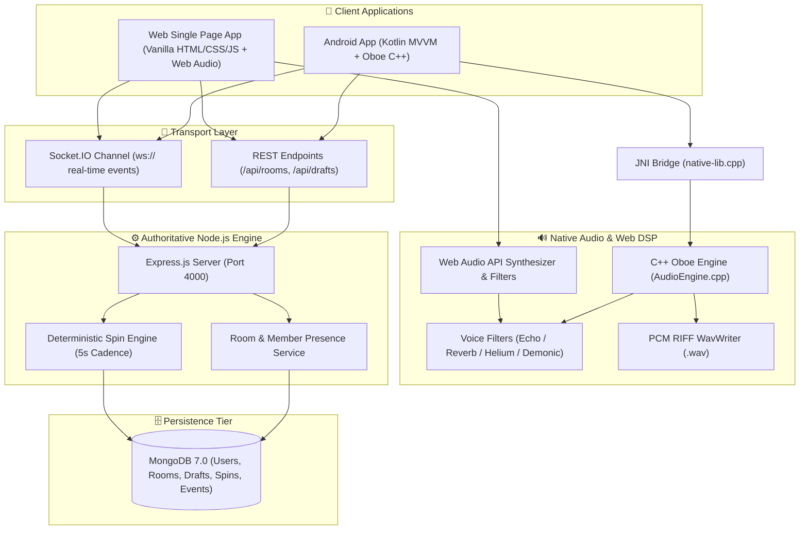

# 🌟 RoxStar Studio

> **Unified Real-Time Collaborative Audio, Voice DSP Studio & Multiplayer Arena**  
> *Built with Kotlin + Native C++ Oboe DSP, Node.js, Express, Socket.IO, and Web Audio API.*

---

## 🎨 Overview & Visual Architecture

**RoxStar Studio** is a full-stack real-time voice collaborative studio and interactive multiplayer spin arena.

- 🎙️ **Native Voice Studio**: Real-time microphone capture with low-latency DSP voice filters (**Clean**, **Echo**, **Reverb**, **Helium 🎈**, **Demonic 😈**), local RIFF WAV draft management, inline renaming, and instant playback.
- 🎡 **Spin Wheel Arena**: Authoritative multi-round elimination game with real-time continuous wheel animation, 5-second round cadences, player elimination SFX + flash feedback, survivor tracking, and full-screen confetti winner celebrations.
- ⚡ **Real-Time Room Engine**: Zero-lag presence management, automatic room cleanup (purges empty 0-participant rooms instantly on refresh), dynamic draft sharing across members, and auto-transferring ownership.
- 🐳 **Enterprise DevOps & Cloud**: Docker multi-stage containers, Docker Compose, GitHub Actions CI/CD workflows, and production deployment guides for AWS ECS, GCP Cloud Run, and Azure Container Apps.

---



---

## ✨ Features at a Glance

### 🎤 Voice DSP Studio
- **5 Real-Time Audio Filters**:
  - `NONE`: Clean direct 16-bit PCM voice recording.
  - `ECHO`: Circular delay line buffer with configurable decay feedback factor and wet/dry mix.
  - `REVERB`: Schroeder reverb architecture with 8 parallel comb filters and 4 cascaded all-pass filters.
  - `HELIUM` 🎈: High-pitch formant shift (~1.65x - 1.75x multiplier) for chipmunk voice mode.
  - `DEMONIC` 😈: Deep pitch growl shift (~0.58x - 0.60x multiplier) with sub-octave saw oscillator and low-pass filter.
- **RIFF WAV Draft Recorder**: Streams uncompressed audio directly into `.wav` files with dynamic byte header updates.
- **Draft Management**: Inline title editing, local audio playback, sharing to active rooms, and deletion.

### 🎡 Real-Time Spin Wheel Arena
- **Continuous Multi-Round Spin**: Wheel rotates continuously while spin state is active, updating remaining contender slices dynamically on every elimination.
- **Authoritative 5s Elimination**: Server-enforced 5-second interval timer eliminates exactly one player per round.
- **Interactive Feedback**: Descending buzz SFX and red panel flash on elimination; ascending chord fanfare, animated trophy box modal, and confetti celebration on winner crowning (+100 Virtual Points).
- **8 Edge Cases Handled**:
  1. *Insufficient Players*: Fails gracefully if `< 3` connected contenders exist.
  2. *Idempotency & Conflict Guard*: Prevents duplicate or concurrent spin starts (`409 Conflict`).
  3. *Mid-Spin Spectators*: Late-joining users watch in spectator mode without interrupting active rounds.
  4. *Mid-Spin Disconnections*: Disconnected users are prioritized for elimination to ensure fair play for online members.
  5. *State Synchronizer*: Reconnecting users receive full active spin state and countdown snapshot.
  6. *Owner Drop Safety*: Game continues autonomously even if room owner leaves mid-spin.
  7. *Empty Room Abort*: Aborts spin automatically if all members leave during a round.
  8. *Empty Room Purge*: Rooms with 0 connected members are auto-deleted on list refresh.

---

## 🚀 Quick Start Guide

### 1. Prerequisites
- **Node.js** >= 20.x
- **Docker & Docker Compose** (Optional for containerized run)
- **Android Studio** (For `/android-app` compilation with CMake 3.22+ and NDK 25+)

### 2. Local Backend Run

```bash
# 1. Clone & enter project folder
git clone https://github.com/AkhilYeddu/RoxStar_App.git
cd Assignment/backend

# 2. Install dependencies
npm install

# 3. Start local server with web UI
npm run dev
```

The application will start on **`http://localhost:4000`**.  
Open `http://localhost:4000` in your web browser to access the Web Studio & Arena!

### 3. Running with Docker Compose

```bash
cd Assignment/infrastructure
docker compose up --build -d
```

---

## 🛠️ Project Structure

```
.
├── android-app/             # Android Kotlin Application (MVVM + ViewModels)
│   ├── app/src/main/cpp/    # JNI Bridge (native-lib.cpp) & CMakeLists.txt
│   └── app/src/main/java/   # Kotlin UI Screens, Room & Audio Repositories
├── native-audio/            # Native C++ Audio Processing Engine
│   ├── include/effects/     # AudioEffect, EchoEffect, ReverbEffect, HeliumEffect, DemonicEffect
│   ├── src/effects/         # C++ DSP implementations
│   └── src/wav/             # WavWriter (RIFF/WAV binary stream writer)
├── backend/                 # Node.js + Express + Socket.IO Server
│   ├── public/              # Single Page Web App (index.html)
│   ├── src/controllers/     # REST Controllers (Room, Spin, Draft)
│   ├── src/models/          # Mongoose Data Schemas (User, Room, RoomMember, Spin, SpinEvent)
│   ├── src/services/        # RoomService & Authoritative SpinEngine
│   └── src/sockets/         # Real-time WebSocket Event Handlers
├── database/                # Database Schemas & Mongoose Indexing Docs
└── infrastructure/          # Docker Compose, GitHub Actions CI/CD & Deployment Guides
    ├── aws/                 # AWS ECS Fargate Deployment
    ├── gcp/                 # GCP Cloud Run Deployment
    └── azure/               # Azure Container Apps Deployment
```

---

## 📡 REST API & WebSocket Reference

### 🔹 Primary REST Endpoints

| Method | Endpoint | Description |
|---|---|---|
| `GET` | `/api/health` | Service health status & timestamp |
| `GET` | `/api/rooms` | List active rooms with connected participants (auto-purges empty rooms) |
| `POST` | `/api/rooms` | Create a new room |
| `GET` | `/api/rooms/:roomId` | Get authoritative details of a specific room |
| `POST` | `/api/rooms/:roomId/join` | Join an existing room |
| `POST` | `/api/rooms/:roomId/spin/start` | Start authoritative 5s spin wheel elimination |
| `GET` | `/api/drafts/user/:userId` | Get voice drafts recorded by user |
| `POST` | `/api/rooms/:roomId/drafts` | Share voice draft to room |

### ⚡ WebSocket Events (`Socket.IO`)

| Event Name | Direction | Payload & Action |
|---|---|---|
| `user_joined` | Broadcast | Triggered when a new user enters room channel |
| `user_left` | Broadcast | Triggered when a user exits or disconnects from room |
| `draft_shared` | Broadcast | Pushes newly shared voice draft details to room members |
| `spin_started` | Broadcast | Signals start of multi-round spin wheel with active contenders |
| `user_eliminated` | Broadcast | Emitted every 5s with eliminated user and remaining survivors |
| `winner_announced` | Broadcast | Announces final survivor, awarded +100 points, and completion |
| `room_state` | Direct/Room | Authoritative state snapshot sent to clients |

---

## 🧪 Verification & Automated Testing

Run the automated test suite:

```bash
cd backend
npm test
```

Executes test suites for API routes, socket handlers, database schemas, and authoritative spin logic with in-memory MongoDB fallback.

---

## 📄 License & Credits

Built with ❤️ by **Akhil Yeddu** for the **RoxStar Platform Technical Assessment**.  
Powered by Oboe Audio, Node.js, Express, Socket.IO, and Web Audio API.