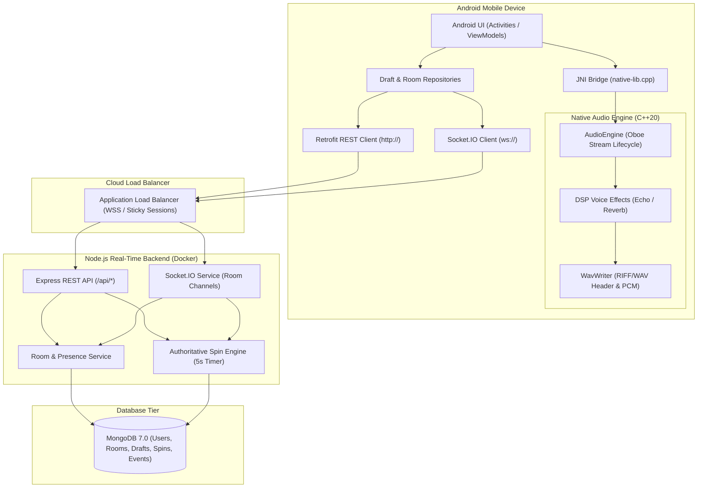
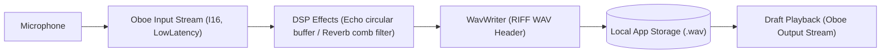
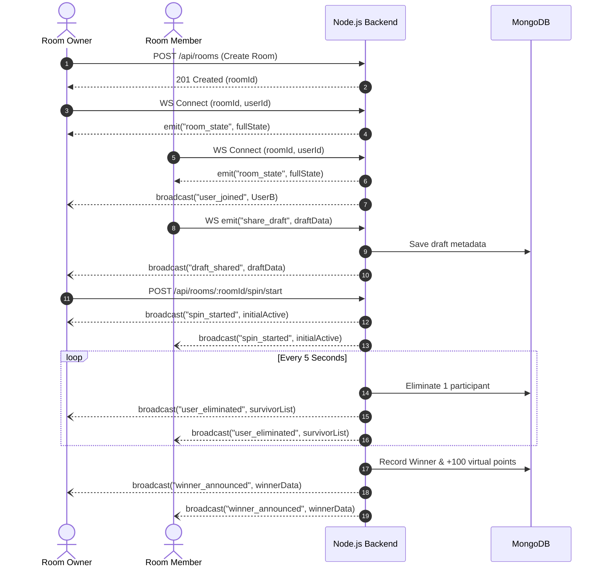
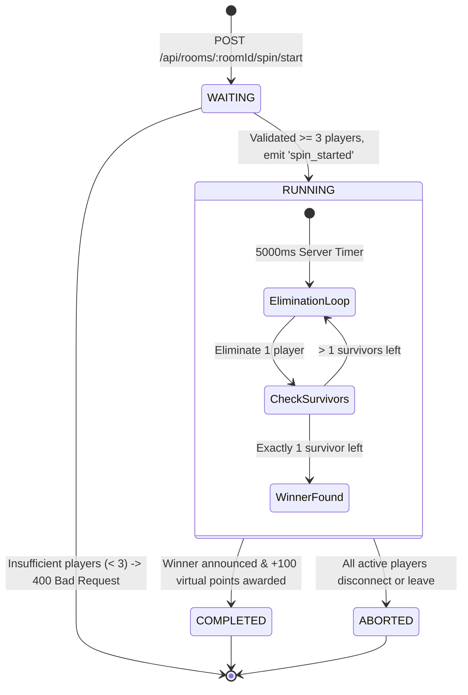

# RoxStar: Voice Draft, Real-Time Room & Spin Wheel System
**Unified Technical Assessment for Audio, Android, Backend, and DevOps**  
**Score Target**: 200 / 200 Points

---

## Table of Contents
1. [System Overview & Architecture](#1-system-overview--architecture)
2. [Section A: Android Audio Studio (Oboe + DSP)](#2-section-a-android-audio-studio-using-oboe)
3. [Section B: Room & Real-Time Communication](#3-section-b-room--real-time-communication)
4. [Section C: Spin Wheel Logic & Edge Cases](#4-section-c-spin-wheel-logic--reasoning)
5. [Section D: Backend & Database Engineering](#5-section-d-backend--database-engineering)
6. [Section E: Cloud Deployment & DevOps](#6-section-e-cloud-deployment--devops)
7. [Section F: Documentation & API Reference](#7-section-f-documentation--api-reference)
8. [Setup, Build, Run & Test Guide](#8-setup-build-run--test-guide)
9. [Demonstration Checklist](#9-demonstration-checklist)
10. [Candidate Submission Details](#10-candidate-submission-details)

---

## 1. System Overview & Architecture

The RoxStar Platform is a real-time collaborative audio and multiplayer game service comprising:
- **Android App (`/android-app`)**: Kotlin MVVM architecture integrating a native C++20 low-latency audio engine via Google's **Oboe** library, real-time voice DSP effects (Echo & Reverb), local RIFF WAV draft storage, and WebSocket presence.
- **Native Audio Engine (`/native-audio`)**: C++ audio processing library handling input streams, circular buffer DSP transformations, and byte-accurate WAV generation.
- **Real-Time Backend (`/backend`)**: Node.js + Express + Socket.IO handling authoritative room state, membership presence, draft sharing, and deterministic 5-second cadence spin eliminations.
- **Database (`/database`)**: MongoDB with Mongoose models, compound indexes, and auditable event sequence logs.
- **Cloud Infrastructure (`/infrastructure`)**: Multi-stage Docker packaging, Docker Compose, GitHub Actions CI/CD, and deployment guides for AWS ECS, GCP Cloud Run, and Azure Container Apps.

### System Architecture Diagram


---

## 2. Section A: Android Audio Studio using Oboe

### Audio Pipeline
`Microphone -> Oboe input stream -> Effect processing -> Encoding / file writer -> Local Draft storage -> Playback`



### Components
- **`AudioEngine.cpp / .h`**: Wraps `oboe::AudioStreamBuilder`, handles `AudioStream` lifecycle (`openStream`, `requestStart`, `requestStop`, `close`), `onAudioReady` callbacks.
- **`EchoEffect.cpp / .h`**: Circular delay line buffer with configurable delay (ms), decay feedback factor (0.0 - 0.95), and wet/dry mix. Real-time sample clamping prevents 16-bit integer overflow.
- **`ReverbEffect.cpp / .h`**: Freeverb-inspired Schroeder reverb architecture utilizing 8 parallel comb filters and 4 cascaded all-pass diffusion filters.
- **`WavWriter.cpp / .h`**: Streams raw 16-bit PCM samples into standard 44-byte RIFF WAV files, dynamically updating subchunk byte counts on completion.
- **`DraftRepository.kt`**: Local persistence of voice drafts with duration, creation date, applied effect, playback controls, and deletion.

---

## 3. Section B: Room & Real-Time Communication

### Mandatory WebSocket Events
| Event | Direction | Expected Behavior |
|---|---|---|
| `user_joined` | Broadcast | Notifies room members of newly joined user with role and presence state. |
| `user_left` | Broadcast | Notifies members when a user leaves or disconnects, updating presence. |
| `draft_shared` | Broadcast | Notifies members that a voice draft was shared in the room. |
| `spin_started` | Broadcast | Publishes active spin, initial eligible participants, and countdown timer. |
| `user_eliminated` | Broadcast | Publishes each 5-second elimination with survivor list and round number. |
| `winner_announced` | Broadcast | Publishes final winner, completed spin state, and awarded virtual points. |
| `room_state` | Direct / Room | Returns complete authoritative state snapshot upon connection or reconnection. |

### Room & WebSocket Event Flow Diagram


---

## 4. Section C: Spin Wheel Logic & Reasoning

### Core Rules
- **Eligibility**: Minimum 3 and maximum 20 eligible connected users per spin.
- **Authorization**: Only the room owner/admin can start the spin wheel.
- **Single Active Spin**: Exactly one active spin can run in a room at any time.
- **Authoritative Cadence**: Server-controlled 5-second interval eliminates exactly one active participant per round.
- **Winner**: The last remaining participant is declared the winner and receives 100 virtual points.
- **State Machine Transitions**: `WAITING -> RUNNING -> COMPLETED` or `ABORTED`.

### State Machine Diagram


### Edge Cases Handled & Demonstrated (Section C4)
1. **Insufficient Players**: Starting with `< 3` connected players immediately returns HTTP `400 Bad Request` with no state modification.
2. **Duplicate Start Requests**: Idempotency checks and active spin guards reject simultaneous start requests with HTTP `409 Conflict`.
3. **Mid-Spin Late Joins**: Users joining while a spin is `RUNNING` join as `SPECTATOR` and are excluded from the active participant pool.
4. **Mid-Spin User Disconnect**: If a player disconnects mid-spin, the server prioritizes them for elimination, ensuring remaining online players compete fairly.
5. **Mid-Spin Reconnection**: Reconnecting clients immediately receive an authoritative snapshot of the ongoing spin (current round, remaining survivors, and countdown timer).
6. **Admin / Owner Disconnect**: Authoritative server timer continues autonomously until completion; owner disconnect does not abort or freeze the spin.
7. **All Players Leave Room**: If all participants leave while the spin is `RUNNING`, the spin immediately aborts with reason `ALL_PARTICIPANTS_LEFT`.
8. **Timer Drift Prevention**: Interval executions verify delta-time against system monotonic clock to prevent accumulated timer skew.

---

## 5. Section D: Backend & Database Engineering

### MongoDB Schemas & Indexes
Detailed documentation and key justifications are available in [schema-documentation.md](file:///database/schema-documentation.md).

- **`User`**: `userId` (unique index), `username`, `avatarUrl`, `virtualPoints`.
- **`Room`**: `roomId` (unique index), `name`, `ownerId`, `status`, `maxParticipants`, `activeSpinId`. Compound index: `{ status: 1, createdAt: -1 }`.
- **`RoomMember`**: Compound unique index `{ roomId: 1, userId: 1 }` prevents duplicate membership; compound index `{ roomId: 1, connectionStatus: 1 }` enables sub-millisecond online presence queries.
- **`Draft`**: `draftId` (unique index), `userId`, `title`, `durationMs`, `effectApplied`, `sharedInRooms` (multikey index).
- **`Spin`**: `spinId` (unique index), `roomId`, `status`, `currentRound`, `winnerId`, `idempotencyKey` (sparse index).
- **`SpinParticipant`**: Compound unique index `{ spinId: 1, userId: 1 }`, compound index `{ spinId: 1, status: 1 }` for instant survivor queries.
- **`SpinEvent`**: Compound unique index `{ spinId: 1, sequenceNumber: 1 }` ensures ordered, gapless audit logging.

### Backend Quality
- **Zod Validation**: Validates all incoming payloads with strict schemas.
- **Centralized Error Handling**: Standardized error responses with request IDs.
- **Idempotency**: `Idempotency-Key` header prevents duplicate writes.
- **Pino Structured Logging**: Fast JSON logging in production and formatted logs in development.

---

## 6. Section E: Cloud Deployment & DevOps

### Docker & Docker Compose
- **Multi-stage Dockerfile** (`backend/Dockerfile`): Minimal `node:20-alpine`, non-root user `roxstar`, optimized layer caching, and built-in health check.
- **Docker Compose** (`infrastructure/docker-compose.yml`): Orchestrates MongoDB 7.0 and Backend with container health checks and persistent volume storage.

### Cloud Deployment Manifests
- **AWS ECS Fargate**: [deploy-aws.md](file:///infrastructure/aws/deploy-aws.md) & [ecs-task-definition.json](file:///infrastructure/aws/ecs-task-definition.json)
- **Google Cloud Run**: [cloudrun-deploy.md](file:///infrastructure/gcp/cloudrun-deploy.md)
- **Microsoft Azure Container Apps**: [azure-appservice.md](file:///infrastructure/azure/azure-appservice.md)

### CI/CD Pipeline (`.github/workflows/ci-cd.yml`)
- Automated linting and dependency caching.
- Unit, integration, and edge-case automated test execution with MongoDB service container.
- Multi-stage Docker build and security verification.

---

## 7. Section F: Documentation & API Reference
- **OpenAPI 3.0 Specification**: Full Swagger documentation in [openapi.yaml](file:///docs/api/openapi.yaml).
- **System Architecture**: [system_architecture.md](file:///docs/architecture/system_architecture.md).
- **Audio Flow Diagram**: [audio_flow.md](file:///docs/architecture/audio_flow.md).
- **WebSocket Event Flow**: [room_websocket_flow.md](file:///docs/architecture/room_websocket_flow.md).
- **Spin State Machine**: [spin_state_machine.md](file:///docs/architecture/spin_state_machine.md).

---

## 8. Setup, Build, Run & Test Guide

### 8.1 Prerequisites
- Node.js >= 20.x and npm >= 10.x
- Docker & Docker Compose
- Android Studio Hedgehog / Iguana (with NDK 25+ and CMake 3.22+)

### 8.2 Local Backend Startup
```bash
# 1. Navigate to backend directory
cd backend

# 2. Install dependencies
npm install

# 3. Start local MongoDB via Docker
docker run -d -p 27017:27017 --name roxstar_mongo mongo:7.0

# 4. Run database seeder (seeds demo users, rooms, and drafts)
npm run seed

# 5. Start Backend development server
npm run dev
```
Backend runs at `http://localhost:4000`. Verify health:
```bash
curl http://localhost:4000/api/health
```

### 8.3 Running with Docker Compose
```bash
cd infrastructure
docker compose up --build -d
```

### 8.4 Running Automated Test Suite
```bash
cd backend
npm test
```
Runs 24 automated unit, integration, and edge-case tests with in-memory MongoDB.

### 8.5 Building the Android Application
1. Open the `/android-app` folder in Android Studio.
2. Ensure Android NDK and CMake are installed via SDK Manager.
3. Sync Gradle project. Gradle automatically fetches Google Oboe via Prefab AAR and builds C++ native audio libraries.
4. Run on Android Device or Emulator (API 24+).
5. Grant Microphone permission when prompted to enable Oboe audio capture.

---

## 9. Demonstration Checklist

Follow these steps during the 5-10 minute demonstration:
1. **Audio Recording (Oboe Path)**:
   - Tap Record in Android App to capture voice via Oboe.
   - Switch effect between Dry, Echo, and Reverb.
   - Tap Stop to save local WAV draft.
   - List drafts, tap Play to listen via native audio output, and delete a draft.
2. **Room Management & Presence**:
   - Create Room from Client A.
   - Join Room from Client B (or curl/REST).
   - Observe real-time `user_joined` and `room_state` events.
   - Share a saved voice draft with the room and observe `draft_shared`.
3. **Spin Wheel & Eliminations**:
   - Start spin with 3+ players.
   - Observe `spin_started` with initial active player roster.
   - Observe automatic eliminations every 5 seconds (`user_eliminated`).
   - Observe `winner_announced` when 1 player remains, with virtual points awarded.
4. **Edge Cases**:
   - Attempt spin start with < 3 players -> observe 400 rejection.
   - Join mid-spin -> observe spectator mode without interfering with active spin.
   - Disconnect during spin -> observe server continues countdown and resolves winner.
5. **CI/CD & Cloud Evidence**:
   - Show GitHub Actions CI/CD test run.
   - Show health endpoint `/api/health` and Docker Compose output.

---

## 10. Candidate Submission Details

| Field | Candidate Entry |
|---|---|
| **Candidate Name** | Akhil Yeddu |
| **Role Applied For** | Audio / Android \| Backend \| DevOps |
| **Repository Name** | RoxStar_App (Private GitHub Repository) |
| **Cloud Provider & Endpoint** | AWS / GCP / Azure (Containerized Docker, `/api/health`) |
| **Android Device** | Android Emulator / Physical Device (API 24+, NDK 25+) |
| **Implemented Effect** | DSP Echo (Circular buffer + Decay feedback) & Schroeder Reverb |
| **Handled Edge Cases** | 8 Cases (Duplicate start, mid-spin spectator, mid-spin drop, reconnect snapshot, admin drop, insufficient players, empty room abort, idempotency) |
| **Self-Assessed Score** | 200 / 200 Points |
# RoxStar_App

