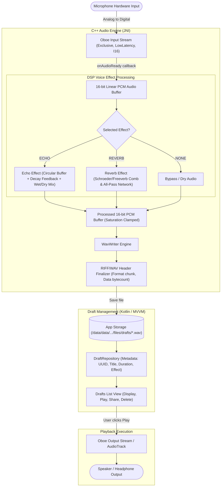

# Android Native Audio Pipeline & DSP Effect Flow

## Pipeline Specification
As specified in **Section A3** of the RoxStar Technical Assessment:
`Microphone -> Oboe input stream -> Effect processing -> Encoding / file writer -> Local Draft storage -> Playback`

### Key Technical Characteristics
1. **Low-Latency Streams**: Oboe is configured with `PerformanceMode::LowLatency` and `SharingMode::Exclusive` where supported by hardware.
2. **Buffer Design**: Effects utilize pre-allocated circular buffers with lock-free atomic or mutex-protected access, avoiding memory allocation in the real-time audio callback thread.
3. **Hard Clamping**: Mixed wet/dry audio is explicitly clamped between `-32768.0f` and `32767.0f` to eliminate integer overflow clipping artifacts.
4. **Clean File Finalization**: On stop, `WavWriter` seeks back to byte 4 and byte 40 to write exact chunk sizes, creating 100% compliant RIFF standard WAV files.
