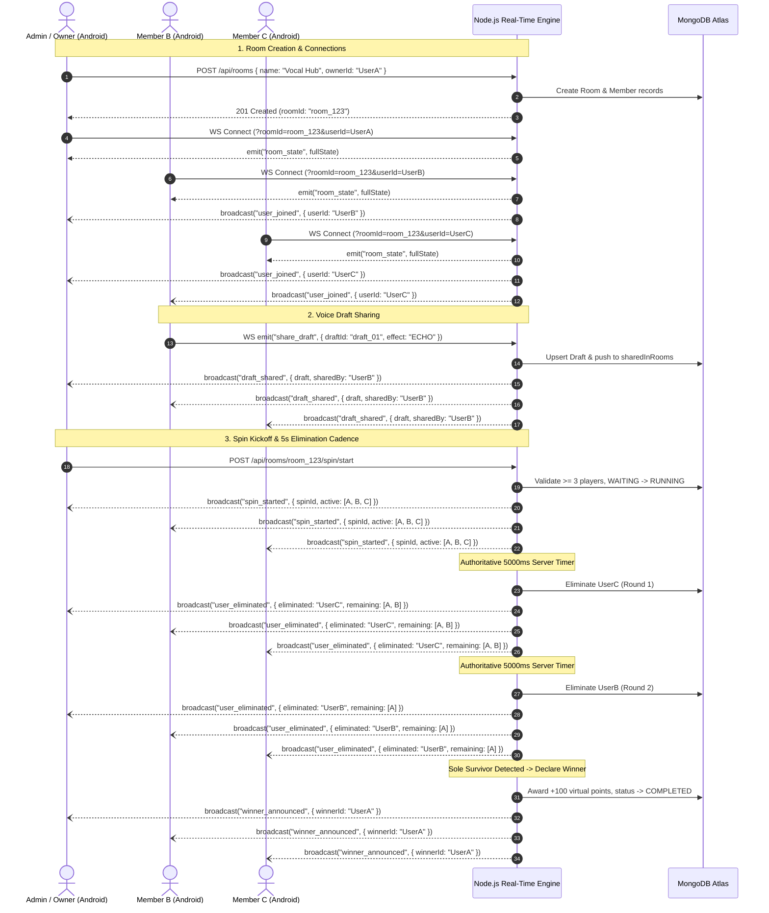

# Real-Time Room & WebSocket Event Flow

## Event Specifications (Section B2)
| Event Name | Direction | Payload Description | Trigger Condition |
|---|---|---|---|
| `user_joined` | Server -> Room | `{ userId, username, role, connectionStatus }` | Member connects/joins room |
| `user_left` | Server -> Room | `{ userId, reason }` | Member disconnects or leaves |
| `draft_shared` | Server -> Room | `{ draft: { id, title, durationMs, effectApplied, fileUrl }, sharedBy }` | Member shares a voice draft |
| `spin_started` | Server -> Room | `{ spinId, roomId, status, round, activeParticipants, nextEliminationCountdownSeconds }` | Admin/Owner starts spin |
| `user_eliminated` | Server -> Room | `{ spinId, round, eliminatedUserId, remainingUsers, nextEliminationCountdownSeconds }` | Authoritative 5s interval knocks out player |
| `winner_announced` | Server -> Room | `{ spinId, winnerId, winnerUsername, virtualPointsAwarded, spinState }` | Last player standing wins |
| `room_state` | Server -> Client | Full snapshot of room metadata, participants, active drafts, and active spin | On connect, reconnect, or sync request |

