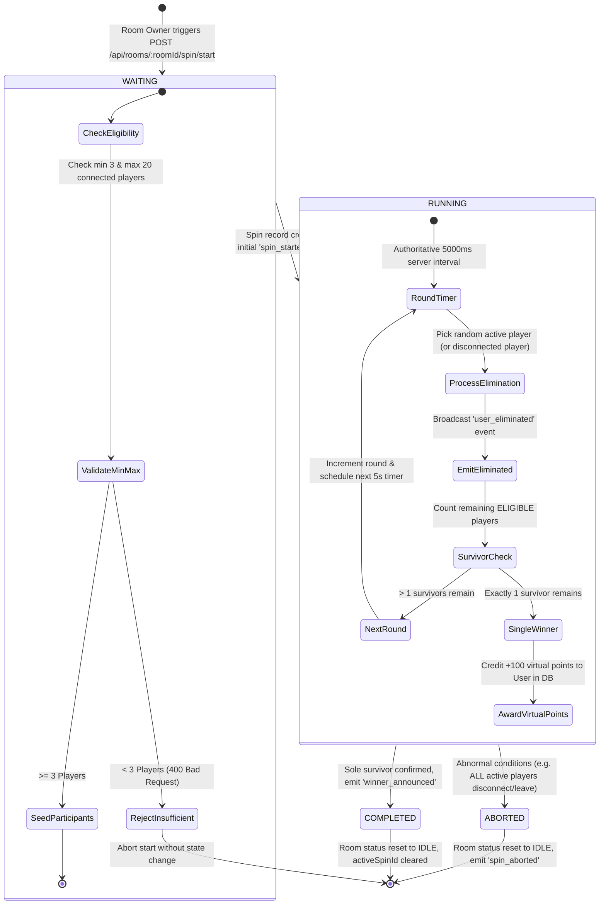

# Spin Wheel Lifecycle & State Machine Architecture

## 1. State Machine Specification
As defined in **Section C1** of the RoxStar Technical Assessment:

---

## 2. Invariants & Rules
1. **Single Active Spin Invariant**: A room can have at most ONE spin with status `RUNNING` or `WAITING` at any moment. Any concurrent start request is rejected with `409 Conflict`.
2. **Deterministic Cadence**: Eliminations occur on an authoritative 5-second interval powered by the Node.js event loop with elapsed time checks.
3. **Survivor Monotonicity**: Active survivor count strictly decreases by 1 in each 5s round until exactly 1 winner is left.
4. **Idempotency & Reconnection**: Every elimination event is recorded in the `SpinEvent` collection with an atomic sequential index (`sequenceNumber`), guaranteeing reconnecting clients can rebuild the complete audit trail.

---

## 3. Handled Edge Cases (Section C4)

| # | Edge Case | Handled Behavior | Resulting State |
|---|---|---|---|
| **1** | Insufficient Players (< 3) | Rejects start request with HTTP 400 and descriptive error message. | `IDLE` (no spin created) |
| **2** | Duplicate Start Requests | Idempotency guard / active spin check rejects with HTTP 409 Conflict. | Ongoing spin uninterrupted |
| **3** | Mid-Spin Late Joins | Late joiner is admitted to room with `SPECTATOR` status and excluded from elimination/winner pool. | Running spin unaffected |
| **4** | Mid-Spin User Disconnect | Disconnected participant is prioritized for elimination or flagged as inactive; game continues for remaining connected players. | `RUNNING` |
| **5** | Mid-Spin Reconnection | Connecting client immediately receives full `spin_state` snapshot containing current round, survivors, and countdown timer. | Synchronized client state |
| **6** | Admin / Owner Disconnect | Spin continues running autonomously on server interval; ownership can transfer without interrupting spin. | `RUNNING` -> `COMPLETED` |
| **7** | All Active Players Leave | If active survivors count drops to 0 mid-spin, spin immediately terminates with reason `ALL_PARTICIPANTS_LEFT`. | `ABORTED` |
| **8** | Duplicate Network Packets | Idempotency-Key header returns identical cached JSON response without duplicate execution. | Idempotent response |
