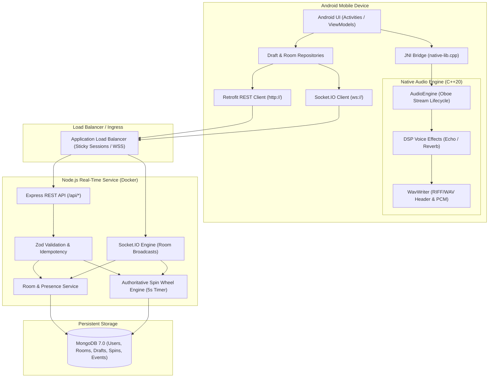

# RoxStar System Architecture

## Architecture Overview

The RoxStar Platform is a real-time multiplayer audio studio and spin-wheel arena consisting of:
1. **Android Application**: Native Android app (Kotlin MVVM + Clean Architecture) with an ultra-low latency C++ audio engine built with Google Oboe.
2. **Real-Time Backend Service**: Node.js + Express + Socket.IO managing authoritative room state, membership presence, draft metadata, and deterministic 5-second cadence spin eliminations.
3. **Database Tier**: MongoDB persistent storage holding users, room records, membership states, draft audio references, and auditable event logs.
4. **Cloud & Infrastructure**: Containerized via Docker, orchestrated with Docker Compose, tested via GitHub Actions CI/CD, and deployed to Cloud (AWS ECS / GCP Cloud Run / Azure Container Apps).

